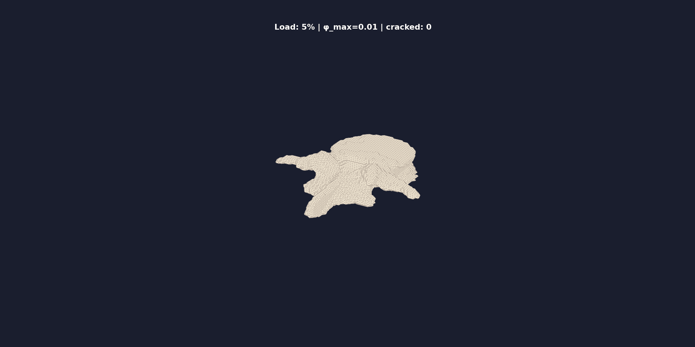

# WiseSpine: CT-Driven Vertebral Fracture Simulation

**Phase Field FEM + Neural Operator for Real-Time Fracture Prediction**

[](https://www.python.org/downloads/release/python-3110/)
[]()

---

## Demo



> **Burst fracture simulation on real L4 vertebra (VerSe sub-verse503).** Left: 3D bone rotating under increasing axial load with phase field damage (beige→yellow→red). Right: Fragment separation with zoom-in 2D slices at crack center (Sagittal, Coronal, Axial).

---

## Overview

WiseSpine simulates vertebral fractures using a **phase field fracture** approach coupled with voxel-based FEM. The pipeline takes a clinical CT scan and produces:

1. **Crack propagation** — Phase field φ evolves from intact (φ=0) to fully cracked (φ=1)
2. **Fragment detection** — Eroded elements form separated bone fragments  
3. **AO classification** — Automatic A0–A4 classification based on damage metrics
4. **3D visualization** — Animated GIF + static PNG with zoom-in panels

### Architecture

```
CT Volume (NIfTI)
  → Voxel FEM Mesh (8-node hexahedral)
  → Phase Field Fracture (staggered u-φ solver)
    → Ku = F  (mechanical equilibrium, CG + Jacobi preconditioner)
    → Kφ = Fφ (damage evolution, AT-1 energy decomposition)
  → Fragment Detection (erosion → connected components)
  → AO Classification (A0–A4)
  → 3D Surface Rendering (marching cubes + matplotlib)
```

---

## Simulation Results

| Metric | Value |
|--------|-------|
| **AO Classification** | A4 (Burst, Complete) |
| **Force** | 4.0 kN axial |
| **Cracked Elements** | 36.2% (5234/14449) |
| **Fragments** | 5 |
| **Max Displacement** | 88 mm |
| **Solve Time** | 169s (GPU, RTX 2080 Ti) |

### Material Properties

| Property | Cortical | Trabecular |
|----------|----------|------------|
| E (Young's modulus) | ~19,500 MPa | 1–500 MPa (BMD-based) |
| Gc (Fracture toughness) | 5.0 N/mm | 1.0 N/mm |
| ν (Poisson's ratio) | 0.3 | 0.3 |

---

## Quick Start

```bash
conda activate py311

# Run fracture simulation + visualization
python pipeline/modules/fracture_engine_v8.py --cuda

# Output in fracture_v8_demo/:
#   v8_burst_fracture.gif  — Animated fracture progression
#   v8_burst_final.png     — Final state (2-view)
#   v8_log.txt             — Full simulation log
```

---

## Repository Structure

```
wisespine/
├── pipeline/
│   ├── modules/
│   │   ├── fracture_engine_v6.py    # Core: Phase field FEM solver
│   │   ├── fracture_engine_v8.py    # Hybrid: v6 + fragment dynamics + visualization
│   │   ├── ct_physics.py            # CT imaging physics & material mapping
│   │   ├── spine_deformation.py     # Spine geometry utilities
│   │   └── tumor_synthesis.py       # Lesion synthesis (future)
│   ├── causal_graph.py              # Causal DAG for pathology relationships
│   └── run_batch_pipeline.py        # Batch orchestrator
├── fracture_v8_demo/                # Latest simulation outputs
│   ├── v8_burst_fracture.gif        # Fracture animation
│   ├── v8_burst_final.png           # Final state render
│   └── v8_log.txt                   # Simulation log
├── VerSe/                           # VerSe dataset (CT volumes)
├── docs/                            # Documentation
├── figs/                            # Figures
└── _archive/                        # Archived old versions
```

## Roadmap

### Current (v8) — Proof of Concept ✅
- Phase field fracture on voxel FEM (4mm resolution)
- GPU-accelerated CG solver (CuPy)
- 3D animated visualization with zoom-in panels
- AO A0–A4 automatic classification

### Next — Quantitative Accuracy
- [ ] **FEniCSx integration** — Validated FEM solver with Lagrange multiplier BCs
- [ ] **Resolution upgrade** — 0.5mm mesh for accurate crack paths
- [ ] **FNO (Fourier Neural Operator)** — Learn coarse→fine mapping for real-time inference
- [ ] **Clinical validation** — Retrospective CT comparison (pre/post fracture)

### Goal
> CT scan → real-time (10s) fracture prediction with clinical-grade accuracy,  
> enabling scenario-based "what-if" analysis for surgical planning.

---

## Technical Details

### Phase Field Model
- **AT-1** energy functional with spectral strain decomposition
- Damage irreversibility: φ(t+1) ≥ φ(t)
- Degradation: g(φ) = (1-φ)² + k, k=0.05 (residual stiffness)
- Regularization length: l₀ = 4.15mm

### FEM Solver
- 8-node hexahedral voxel elements
- Staggered scheme: 5 iterations per load step, 20 load steps
- GPU solver: CuPy CG with Jacobi preconditioner (tol=1e-8)
- Boundary conditions: Parabolic contact pressure (superior), fixed inferior

### References
- Miehe et al. (2010) — Phase field fracture framework
- Keller (1994) — BMD → E mapping for bone
- Nalla et al. (2003) — Fracture toughness of cortical bone

---

**Contact**: june0604@uw.edu
