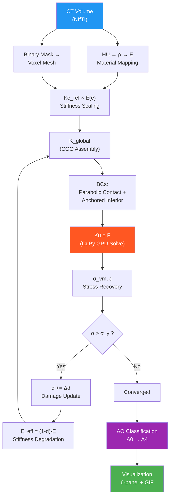
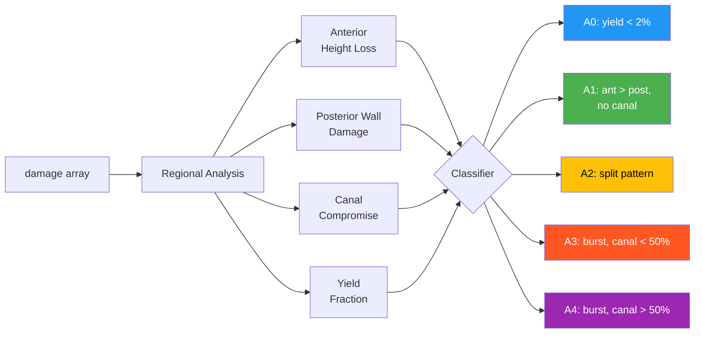

# WiseSpine v5 — Technical Implementation

> Patient-Specific Voxel FEM Fracture Engine for Vertebral Compression Fracture Simulation

---

## Architecture Overview



---

## 1. Mesh Generation

**Source**: [fracture_engine_v5.py → `_setup_mesh()`](file:///gscratch/scrubbed/june0604/wisespine/pipeline/modules/fracture_engine_v5.py#L437-L510)

Each bone voxel in the segmentation mask becomes an **8-node hexahedral finite element**. No external meshing tool is needed — the regular CT grid IS the mesh.

```
Voxel at (i,j,k) → 8 corner nodes:
    (i,j,k), (i+1,j,k), (i+1,j+1,k), (i,j+1,k),
    (i,j,k+1), (i+1,j,k+1), (i+1,j+1,k+1), (i,j+1,k+1)
    
Node ID = i + j·(nx+1) + k·(nx+1)·(ny+1)
DOFs per node = 3 (ux, uy, uz)
```

| Property | Value |
|----------|-------|
| Elements | ~234K (at 2× downsample) |
| Nodes | ~262K |
| DOF | ~784K |
| Element size | 0.66 mm (2× downsample of 0.33mm voxel) |

**Downsample strategy**: `ds = max(1, int(cbrt(n_voxels / 200000)))` — targets ~200K elements for GPU feasibility.

---

## 2. Material Model

**Source**: [hu_to_density](file:///gscratch/scrubbed/june0604/wisespine/pipeline/modules/fracture_engine_v5.py#L69-L80), [density_to_youngs_modulus](file:///gscratch/scrubbed/june0604/wisespine/pipeline/modules/fracture_engine_v5.py#L83-L106), [_setup_materials](file:///gscratch/scrubbed/june0604/wisespine/pipeline/modules/fracture_engine_v5.py#L512-L575)

### 2.1 HU → Density → Young's Modulus

```
CT Hounsfield Unit → Apparent Density:
    ρ_app = HU / 1000  (g/cm³, for HU > 0)

Density → Young's Modulus (MPa):
    Trabecular: E = 6850 × ρ^1.49    (Morgan & Keaveny 2003)
    Cortical:   E = 10500 × ρ^2.29   (Keller 1994)
```

### 2.2 Cortical Shell Blending

Since voxel meshes can't resolve the thin cortical shell (~0.5mm) at coarse resolution, we use **distance-based blending**:

```python
# Distance from bone surface (EDT)
dist = distance_transform_edt(bone_mask) * voxel_size

# Cortical fraction (sigmoid blending)
cortical_fraction = 1 / (1 + exp((dist - cortical_thickness) / 0.3))

# Effective E = blend of trabecular and cortical
E_eff = (1 - cf) × E_trab + cf × E_cort
```

> [!IMPORTANT]
> This is critical for accuracy — without cortical blending, the thin high-stiffness shell would be lost at 2× downsample, making the vertebra ~40% too compliant.

### 2.3 Transverse Isotropy

**Source**: [_transversely_isotropic_matrix](file:///gscratch/scrubbed/june0604/wisespine/pipeline/modules/fracture_engine_v5.py#L199-L232)

Bone is stiffer along the superior-inferior (z) axis. Based on Pahr & Zysset (2009):

| Parameter | Value | Meaning |
|-----------|-------|---------|
| E_z / E_xy | 1.3 | 30% stiffer axially |
| G_xz / G_xy | 1.15 | Shear anisotropy |
| ν_xy | 0.30 | In-plane Poisson's |
| ν_xz | 0.25 | Transverse Poisson's |

The 6×6 elasticity matrix **D** follows transversely isotropic compliance:

```
D = D_iso × correction_factors(E_ratio, G_ratio, ν_xy, ν_xz)
```

### 2.4 Yield Stress

```
σ_y = ε_yield × E × (1 + 0.5 × cortical_fraction)

where ε_yield = 0.0068 (Bayraktar et al. 2004)
```

---

## 3. Element Stiffness

**Source**: [compute_reference_stiffness](file:///gscratch/scrubbed/june0604/wisespine/pipeline/modules/fracture_engine_v5.py#L235-L282)

### 3.1 Reference Stiffness (computed once)

We exploit the fact that all voxel elements have **identical geometry** (same cube size h). Only the Young's modulus E varies per element.

```
Ke_ref = ∫ B^T · D(E=1) · B · det(J) dV    (24×24 matrix)

Ke(e) = E(e) × Ke_ref    ← simple scaling!
```

This is the key performance insight: instead of computing 234K full 24×24 integrals, we compute **one** reference integral and scale.

### 3.2 Gauss Quadrature

2×2×2 Gauss points with standard hexahedral shape functions:

```python
# Shape function derivatives at (ξ, η, ζ):
dN/dξ = ∂Ni/∂ξ for i = 1..8
    
# Jacobian (trivial for regular hex):
J = diag(h/2, h/2, h/2)
det(J) = (h/2)³

# Strain-displacement matrix B (6×24):
B[0:3, 3n:3n+3] = [[dN/dx, 0, 0], [0, dN/dy, 0], [0, 0, dN/dz]]
B[3:6, ...]      = shear terms
```

---

## 4. Global Assembly

**Source**: [_assemble_global_stiffness](file:///gscratch/scrubbed/june0604/wisespine/pipeline/modules/fracture_engine_v5.py#L583-L606)

**Fully vectorized** — no Python for-loops over elements:

```python
# Ke_ref.ravel() → (576,) template
# elem_dofs → (n_elem, 24) DOF indices per element

rows = elem_dofs[:, li_flat]     # (n_elem, 576) row indices
cols = elem_dofs[:, lj_flat]     # (n_elem, 576) col indices
vals = E_elem[:, None] * Ke_flat # (n_elem, 576) values

K = coo_matrix((vals.ravel(), (rows.ravel(), cols.ravel())))
```

Assembly time: **~20s** for 234K elements (CPU).

---

## 5. Boundary Conditions

**Source**: [_apply_boundary_conditions](file:///gscratch/scrubbed/june0604/wisespine/pipeline/modules/fracture_engine_v5.py#L612-L686)

### 5.1 Inferior Endplate (Fixed)

```
z-DOFs: FIXED (penalty method, PENALTY = K_max × 10⁶)
x,y-DOFs: FREE (allows Poisson lateral expansion)

Exception: ONE central node has x,y also fixed → prevents rigid body sliding
```

> [!NOTE]
> Fixing only z-DOFs is physically realistic — the intervertebral disc allows lateral motion. The single-node x,y anchor prevents rigid-body modes that would make the system singular.

### 5.2 Superior Endplate (Loaded)

**Parabolic (Hertzian) contact pressure** instead of uniform:

```
P(r) = P_max × (1 - r²/R²)

where r = distance from endplate center
```

This models realistic disc-endplate contact (center-loaded, not edge-loaded).

**Flexion bias**: Anterior elements receive more force than posterior:
```
weight(AP) = 1 + sin(θ_flex) × (AP - 0.5) × 2
```

---

## 6. Solver

### 6.1 GPU Path (CuPy)

```python
K_gpu = cupyx.scipy.sparse.csr_matrix(K)    # Transfer to GPU
F_gpu = cupy.array(F)
u_gpu = cupyx.scipy.sparse.linalg.spsolve(K_gpu, F_gpu)  # Direct solve
# Fallback: CG with tolerance 10⁻⁸ if direct fails
```

### 6.2 CPU Path (SciPy)

```python
ilu = spilu(K, fill_factor=5)    # Incomplete LU preconditioner
M = LinearOperator(K.shape, ilu.solve)
u, info = cg(K, F, M=M, maxiter=3000, tol=1e-8)
```

Solve time: **~180s per iteration** (GPU), ~600s (CPU).

---

## 7. Progressive Damage

**Source**: [simulate](file:///gscratch/scrubbed/june0604/wisespine/pipeline/modules/fracture_engine_v5.py#L830-L976)

### 7.1 Algorithm

```
for step in [1/4, 2/4, 3/4, 4/4] of total force:
    for iter in 1..5 (damage iterations):
        1. K = assemble(E_base × (1 - d))
        2. Apply BCs with load_fraction
        3. Solve Ku = F
        4. Compute σ_vm per element
        5. stress_ratio = σ_vm / σ_y
        6. Δd = clip((stress_ratio - 1) / 3, 0, 0.2)
        7. d = min(d + Δd, 0.9)
        8. E_eff = clip(E_base × (1 - d), 10, 20000)
        9. if max(|ΔE|) < 1.0: converged → break
```

### 7.2 Stability Controls

| Control | Value | Purpose |
|---------|-------|---------|
| Degradation | Linear: `(1-d)` | Avoids snap-through instability of quadratic |
| Max Δd per iter | 0.2 | Prevents sudden softening |
| Max total d | 0.9 | Keeps minimum element stiffness |
| E floor | 10 MPa | Prevents zero-stiffness elements |
| Yield threshold | d > 0.05 | Sensitive damage detection |

### 7.3 Incremental Loading

4 load steps (25% → 50% → 75% → 100%) approximate geometric nonlinearity:

```
Step 1: F = 0.25 × F_total → damage seeds in weakest elements
Step 2: F = 0.50 × F_total → damage propagates to neighbors
Step 3: F = 0.75 × F_total → fracture band forms
Step 4: F = 1.00 × F_total → final damage pattern
```

Total: up to **20 solve iterations** (4 steps × 5 damage iterations).

---

## 8. AO Classification

**Source**: [_classify_ao](file:///gscratch/scrubbed/june0604/wisespine/pipeline/modules/fracture_engine_v5.py#L723-L818)

Uses continuous damage variable (not binary yield count):



| AO Type | Criteria |
|---------|----------|
| **A0** | Yield fraction < 2% |
| **A1** | Anterior damage > posterior, no canal compromise |
| **A2** | Split pattern (ant ≈ post), moderate damage |
| **A3** | High yield + canal compromise < 50% |
| **A4** | High yield + canal compromise ≥ 50% OR yield > 60% |

---

## 9. Stress Recovery

**Source**: [_compute_element_stress](file:///gscratch/scrubbed/june0604/wisespine/pipeline/modules/fracture_engine_v5.py#L692-L740)

```python
# B matrix at element center (ξ=η=ζ=0), computed ONCE
ε = B @ u_elem              # (6,) strain vector
σ = D(E_elem) @ ε           # (6,) stress vector

# von Mises:
σ_vm = √(0.5 × [(σ_xx-σ_yy)² + (σ_yy-σ_zz)² + (σ_zz-σ_xx)²
         + 6(τ_xy² + τ_yz² + τ_xz²)])
```

Vectorized over all elements simultaneously — no Python loops.

---

## 10. Visualization Pipeline

### 10.1 Fracture Mechanics (6-panel)

**Source**: [_plot_fracture_mechanics](file:///gscratch/scrubbed/june0604/wisespine/pipeline/modules/fracture_engine_v5.py#L1053-L1280)

| Panel | Content | Method |
|-------|---------|--------|
| ① Original CT | Mid-sagittal slice | `ct[mid_x].T` |
| ② Deformed CT | Warped by displacement ×10 | `scipy.ndimage.map_coordinates` |
| ③ Crack Lines | Damage + contour at d=0.3/0.6/0.9 | `plt.contour` + inferno cmap |
| ④ Displacement Vectors | Quiver plot of (uy, uz) | `plt.quiver` |
| ⑤ Height Profile | Original vs deformed column heights | Fill-between plot |
| ⑥ Metrics | AO type, force, yield%, etc. | Text box |

### 10.2 GIF Progression

**Source**: [_save_progression_gif](file:///gscratch/scrubbed/june0604/wisespine/pipeline/modules/fracture_engine_v5.py#L1291-L1397)

Captures frames during simulation via `engine._capture_frames = True`. Each frame stores `{step, iteration, von_mises, damage, displacement}`. Renders to PIL → animated GIF at 3 fps.

---

## 11. Performance

| Stage | Time (GPU) | Time (CPU) |
|-------|-----------|-----------|
| Mesh setup | 2s | 2s |
| Material setup | 1s | 1s |
| Assembly (per iter) | 20s | 20s |
| Solve (per iter) | 180s | 600s |
| Stress recovery | 0.5s | 0.5s |
| **Total (20 iters)** | **~18 min** | **~60 min** |

### Memory

| Component | Size |
|-----------|------|
| K matrix (sparse) | ~800 MB |
| DOF vectors | ~6 MB each |
| Element data | ~14 MB |
| **GPU peak** | **~2 GB** |

---

## 12. File Structure

```
pipeline/modules/
├── fracture_engine_v5.py        # Core FEM engine (1,771 lines)
│   ├── Material functions       # HU → ρ → E → σ_y
│   ├── Hex element stiffness    # Ke_ref computation
│   ├── VoxelFEMEngine class     # Main engine
│   │   ├── _setup_mesh()        # Voxel → hex connectivity
│   │   ├── _setup_materials()   # Per-element E, σ_y, cortical fraction
│   │   ├── _assemble_global()   # Vectorized COO assembly
│   │   ├── _apply_bcs()         # Parabolic contact + anchoring
│   │   ├── simulate()           # Incremental load + progressive damage
│   │   └── _classify_ao()       # Continuous damage → AO type
│   ├── Visualization functions  # _plot_scenario, _plot_fracture_mechanics
│   └── Demo script              # 3 scenarios + sweeps + GIF
├── test_usecases_v5.py          # Clinical use-case tests
└── _gen_real_fracture_visuals.py # load_vertebra() helper
```

---

## 13. Key References

| Topic | Reference | Used For |
|-------|-----------|----------|
| Trabecular E-ρ | Morgan & Keaveny, J Biomech 2003 | `E = 6850ρ^1.49` |
| Cortical E-ρ | Keller, J Biomech 1994 | `E = 10500ρ^2.29` |
| Yield strain | Bayraktar et al., J Biomech 2004 | `ε_y = 0.0068` |
| Anisotropy ratios | Pahr & Zysset, J Biomech 2009 | E_z/E_xy = 1.3 |
| Trabecular anisotropy | Rho, J Biomech 1993 | G_xz/G_xy ratios |
| Vertebral FEM validation | Crawford et al., Bone 2003 | Force-failure correlation |
| AO Classification | Magerl et al., Eur Spine J 1994 | A0-A4 criteria |

---

*WiseSpine v5 — University of Washington, Harborview Medical Center*  
*March 2026*
