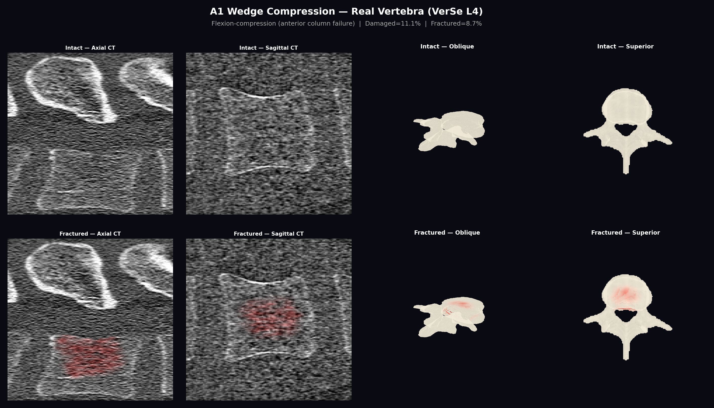
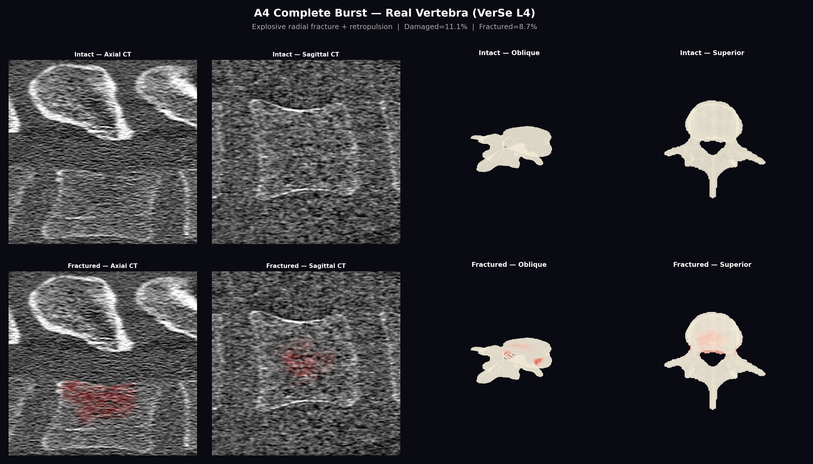
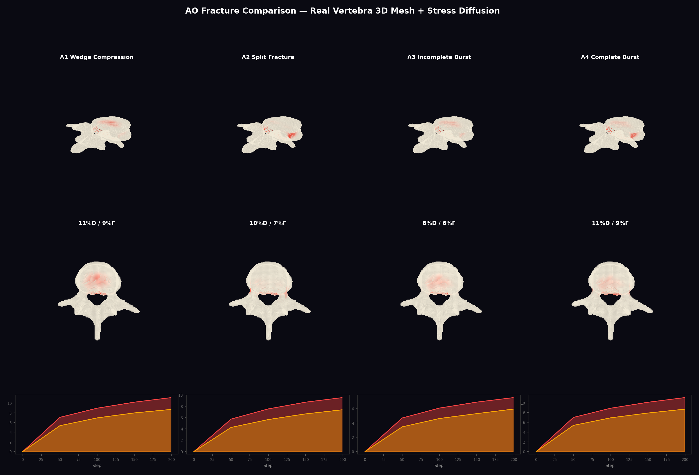
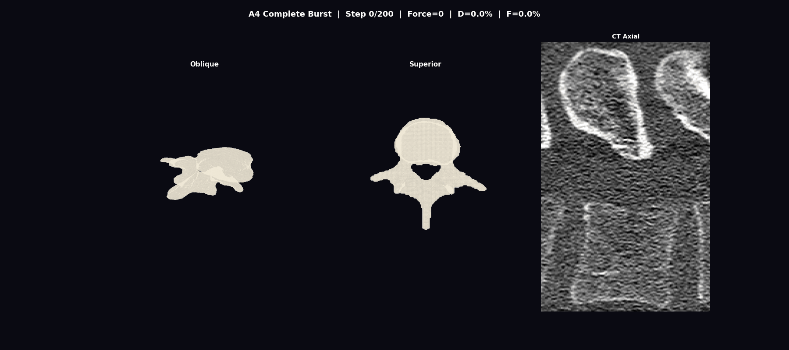
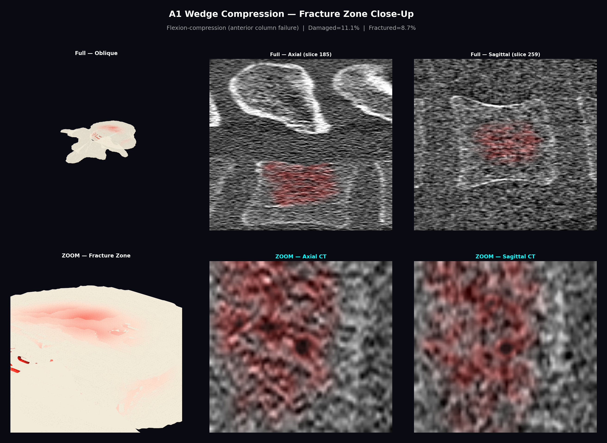
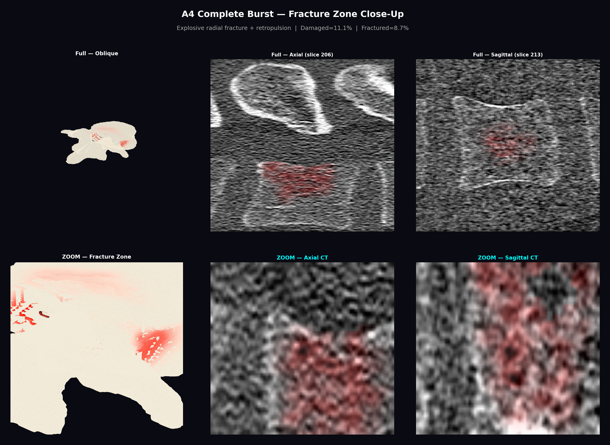
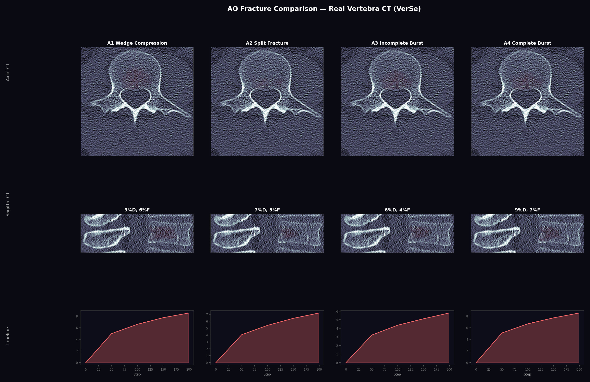
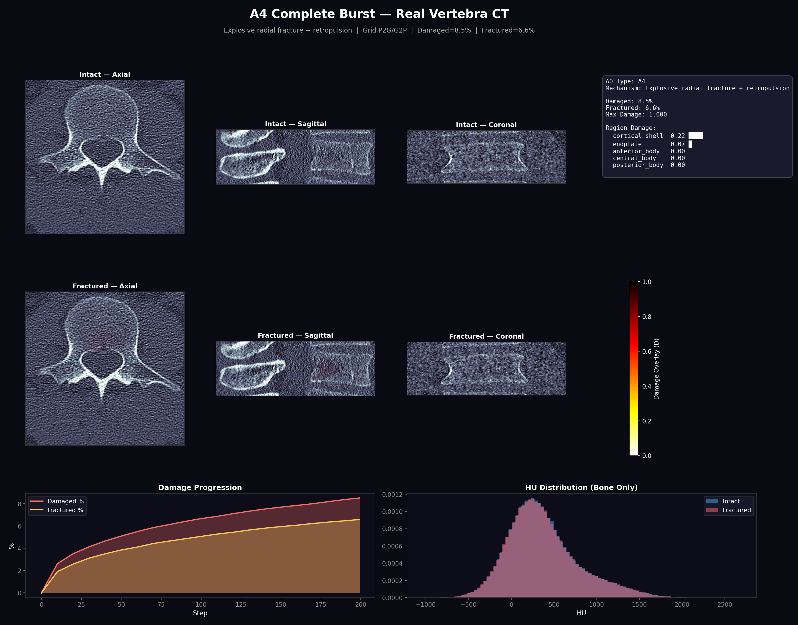

# Bone Fracture Physics Simulation

> Technical documentation for the Wisespine fracture simulator (v2).
> All simulations use **grid-based P2G/G2P stress transfer** — the physically correct method.
> All visualizations are rendered on a **real L4 vertebra** from the VerSe dataset (sub-verse503, label 22).

---

## Architecture Overview

```
┌─────────────────────────────────────────────────┐
│             Fracture Simulator v2               │
├─────────────────────────────────────────────────┤
│  ┌──────────┐  ┌───────────┐  ┌──────────────┐ │
│  │ Particle │  │  Grid-Based│  │    Damage    │ │
│  │Generator │→ │  P2G/G2P  │→ │  Evolution   │ │
│  │ (50K pts)│  │  Stress   │  │  CDM + Aniso │ │
│  └──────────┘  └───────────┘  └──────────────┘ │
│       ↓              ↓              ↓           │
│  ┌──────────┐  ┌───────────┐  ┌──────────────┐ │
│  │  Region  │  │  AO-Type  │  │  Fragment    │ │
│  │ Classify │  │  Loading  │  │  Detection   │ │
│  └──────────┘  └───────────┘  └──────────────┘ │
│       ↓              ↓              ↓           │
│  ┌──────────────────────────────────────────┐   │
│  │   Deformation: COD + Fragment Separation │   │
│  └──────────────────────────────────────────┘   │
└─────────────────────────────────────────────────┘
```

### How It Works

1. **Particle Sampling** — 50,000 particles sampled from real segmentation mask geometry
2. **Region Classification** — 7 anatomical zones (anterior/central/posterior body, cortical shell, endplate, pedicle, lamina)
3. **AO-Type Loading** — Biomechanically-specific force points for each fracture type
4. **Grid-Based Stress** — P2G deposit → Poisson diffusion (50 iter) → G2P gather
5. **Damage Evolution** — CDM model: stress accumulates damage D ∈ [0,1]
6. **CT Mapping** — Particle damage mapped back to voxel space → HU values modified (micro-cracks darken, macro-cracks create gaps)

---

## Real Vertebra — Combined CT + 3D Mesh Visualization

Surface mesh extracted from L4 segmentation mask via marching cubes (52,840 vertices, 105,680 faces). Each visualization combines **CT slices** (axial + sagittal, bone-windowed) with **3D mesh renders** (oblique 3/4 + superior view). Damage coloring uses a combined stress+damage colormap: bone white (intact) → red glow (stress diffusion) → amber/red (micro-damage) → charcoal (shattered).

### A1 Wedge Compression — CT + 3D Mesh



> Damage concentrates in the anterior body — consistent with clinical A1 wedge compression. Red stress diffusion radiates from the load point through the vertebral body. Posterior elements remain intact.

### A4 Complete Burst — CT + 3D Mesh



> The most severe AO type. 5-point loading creates radial fracture pattern visible as red zones spreading across the mesh surface and dark cracks in CT slices.

---

### AO Comparison (A1–A4) — 3D Mesh + Stress Diffusion



> Row 1: Oblique 3/4 view showing damage coloring and stress glow. Row 2: Superior (axial) view. Row 3: Damage/fracture progression curves.

| AO | Name | Mechanism | Damaged | Fractured | Pattern |
|---|---|---|---|---|---|
| A1 | Wedge Compression | Flexion-compression | 9% | 6% | Anterior wedging, early onset |
| A2 | Split Fracture | Coronal separation | 7% | 5% | Sagittal split, gradual |
| A3 | Incomplete Burst | Axial compression | 6% | 4% | Posterior wall, delayed |
| A4 | Complete Burst | Explosive radial | 9% | 7% | Radial burst, highest |

---

### Animated Stress Diffusion — 3D Mesh + CT



> 26-frame animation showing red stress glow spreading across the bone surface as force increases. Left: oblique mesh. Center: superior mesh. Right: CT axial with damage overlay.


---

## Fracture Zone Close-Up

Zoom-in views centered on the peak damage voxel, showing fracture details at higher magnification. Each panel compares full view (top) with zoomed view (bottom) across mesh and CT.

### A1 Wedge — Fracture Zone



> Zoomed mesh reveals micro-crack patterns in the anterior cortical shell. Zoomed CT shows the trabecular density reduction (red overlay) characteristic of compression failure.

### A4 Complete Burst — Fracture Zone



> At higher magnification, the radial fracture pattern is clearly visible: multiple crack lines radiating from the center of the vertebral body. Zoomed CT shows fragmented trabecular structure.

---

## Real Vertebra — CT Slice Visualization

Fracture damage is applied directly to CT HU values: micro-fractures reduce HU, macro-cracks create dark gaps (-200 HU), and complete fractures introduce air gaps (-900 HU). Bone-windowed display (WL=400, WW=1800).

### CT Comparison (A1–A4)



> Row 1: Axial CT with damage overlay (red). Row 2: Sagittal CT. Row 3: Damage progression timeline.

### A1 Wedge — CT Detail


> **Key**: Damage (red overlay) concentrated in anterior vertebral body. HU histogram shows a subtle shift toward lower values (bone breakdown). Progression curve shows early damage onset with steady accumulation.

### A4 Complete Burst — CT Detail



> **Key**: The most severe AO type. 5-point loading creates radial fracture pattern visible as dark cracks in axial CT. Damage involves both the body and posterior elements (pedicles).

### CT Fracture Progression — Animated


> 26-frame animation. Axial view shows the vertebral body progressively fracturing under A4 burst loading.


---

## Material Model (CDM)

Damage $D$ evolves from 0 (intact) to 1 (fully fractured):

$$\frac{dD}{dt} = \text{damage\_rate} \times \frac{\sigma_{eff}}{E_0(1-D)^2}$$

| Parameter | Value | Effect |
|---|---|---|
| Damage Rate | 0.15 | Speed of damage accumulation |
| Damage Threshold | 0.002 | Stress level to start damaging |
| COD Threshold | 0.5 | D level where macro-cracks open |
| COD Magnitude | 0.02 | How much crack surfaces separate |

**Stiffness degradation**: As damage increases, bone gets softer → stress redistributes to neighbors → cascade fracture propagation.

---

## Grid-Based Stress Transfer

Stress propagates **only through bone material** — cannot cross air gaps or fractures.

### Algorithm

1. **P2G**: Force deposited with 7×7×7 Gaussian kernel onto 64³ occupancy grid
2. **Grid Diffusion**: 50 iterations of Jacobi relaxation (α=0.6), only through occupied cells
3. **G2P**: Each particle gathers stress from its grid cell

```
Force applied → Grid deposit → Diffuse through bone → Particles receive stress
     ↓                ↓                  ↓                      ↓
  AO-specific    7×7×7 Gaussian    Material-blocked       (1-D)² scaled
  load points    on 64³ grid       air = barrier          stiffness
```

**Why this matters**: A fracture gap (D→1) removes cells from the occupancy grid → stress can no longer cross the crack → realistic load redistribution.

---

## Bone Anisotropy

Trabecular bone is **directionally stronger** along the primary load axis (vertical/SI) due to trabecular alignment:

| Component | Threshold Factor | Effect |
|---|---|---|
| Vertical stress | 2.0× | Harder to damage along trabeculae |
| Horizontal stress | 1.0× (base) | Easier to fracture across grain |
| Cortical shell | 1.5× | Dense lamellar bone |
| Endplate | 0.8× | Thin cortical junction |

---

## Fragment Detection

Uses `scipy.ndimage.label` on binarized damage grid (D > 0.9). Fragment displacement includes:
- **Rigid body translation** — fragments move away from fracture center
- **Retropulsion** — posterior fragments pushed into spinal canal (A3/A4)

---

## Usage

```bash
# Generate combined CT + 3D mesh fracture visualizations (includes zoom views)
python3 pipeline/modules/_gen_3d_mesh_fracture.py

# Generate CT slice fracture visualizations on real vertebra
python3 pipeline/modules/_gen_real_fracture_visuals.py

# Run full physics test
python3 pipeline/modules/fracture_simulator_v2.py --test-full-physics
```

### API

```python
from fracture_simulator_v2 import BoneFractureSimulator, AO_LOAD_CONFIGS
from _gen_real_fracture_visuals import (
    load_vertebra, sample_particles_from_mask,
    configure_for_real_vertebra, particles_to_volume, apply_damage_to_ct
)

# Load real vertebra from VerSe
ct, mask, label = load_vertebra(ct_path, mask_path)

# Sample particles from actual geometry
positions = sample_particles_from_mask(mask, n_particles=50000)

# Fracture simulation
sim = BoneFractureSimulator(positions)
sim.setup_ao_loading('A4')
sim.set_stress_mode('grid')
sim.enable_anisotropy(ratio=2.0)
configure_for_real_vertebra(sim)  # Override thresholds for real geometry
history = sim.run(n_steps=200, max_force=5.0 * 50.0)

# Map damage back to CT voxels
damage_vol = particles_to_volume(sim.positions, sim.damage, ct.shape, mask)
fractured_ct = apply_damage_to_ct(ct, mask, damage_vol)
```
