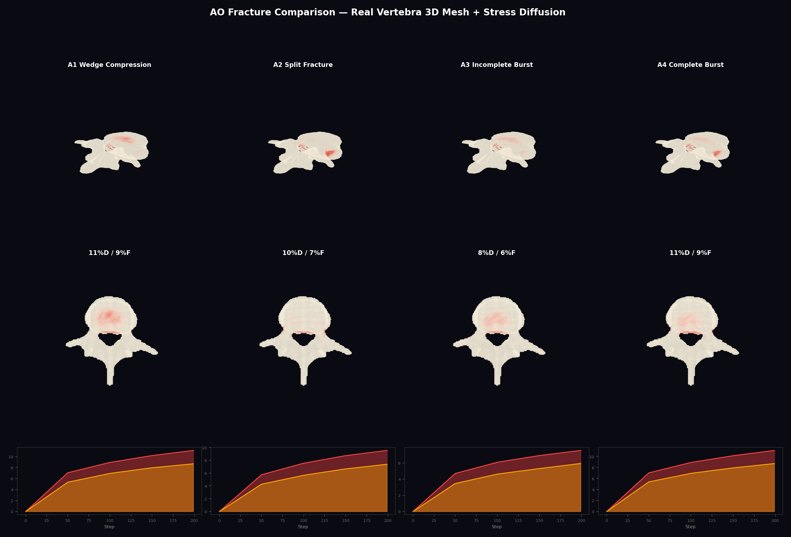
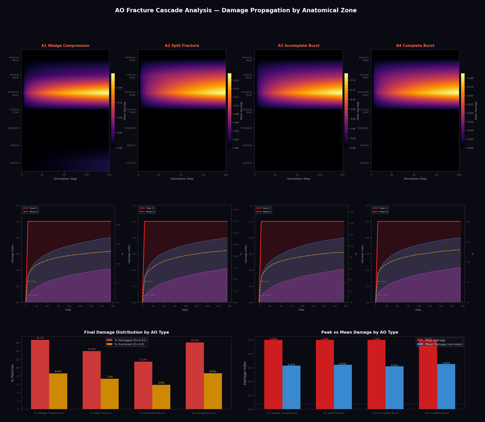
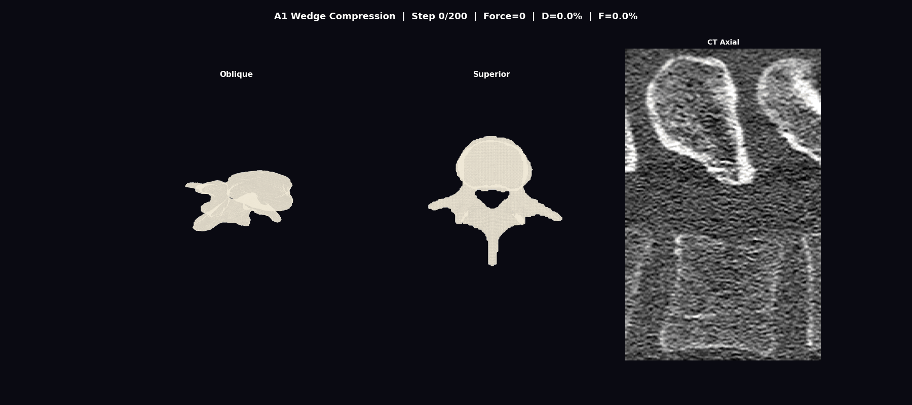
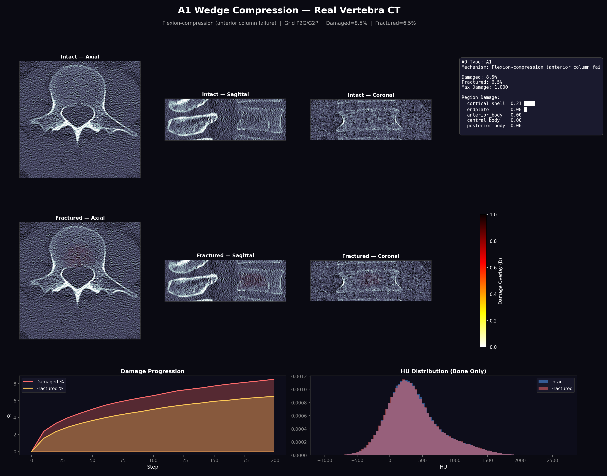
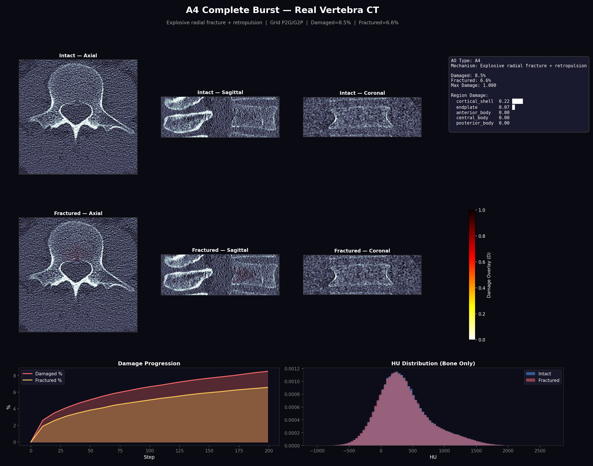
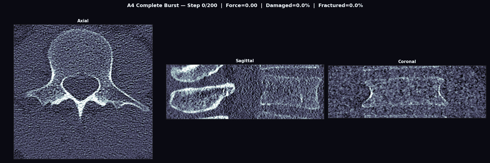
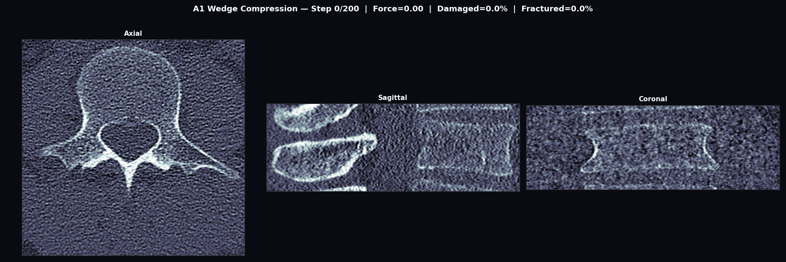

# Bone Fracture Physics Simulation

> Technical documentation for the WiseSpine fracture simulator (v2).
> All simulations use **grid-based P2G/G2P stress transfer** — the physically correct method.
> All visualizations are rendered on a **real L4 vertebra** from the VerSe dataset (sub-verse503, label 22).

---

## Architecture Overview

```
+--------------------------------------------------+
|             Fracture Simulator v2                |
|                                                  |
|  Particle    -> Grid-Based  -> Damage            |
|  Generator      P2G/G2P       Evolution          |
|  (50K pts)      Stress        CDM + Anisotropy   |
|                                                  |
|  Region      -> AO-Type    -> Fragment           |
|  Classify       Loading       Detection          |
|                                                  |
|  --> Deformation: COD + Fragment Separation      |
+--------------------------------------------------+
```

### How It Works

1. **Particle Sampling** — 50,000 particles sampled from real segmentation mask geometry
2. **Region Classification** — 7 anatomical zones (anterior/central/posterior body, cortical shell, endplate, pedicle, lamina)
3. **AO-Type Loading** — Biomechanically-specific force points for each fracture type
4. **Grid-Based Stress** — P2G deposit -> Poisson diffusion (50 iterations) -> G2P gather
5. **Damage Evolution** — CDM model: stress accumulates damage D in [0, 1]
6. **CT Mapping** — Particle damage mapped back to voxel space; HU values modified (micro-cracks darken, macro-cracks create gaps)

---

## Real Vertebra — Combined CT + 3D Mesh Visualization

Surface mesh extracted from L4 segmentation mask via marching cubes (52,840 vertices, 105,680 faces). Each visualization combines **CT slices** (axial + sagittal, bone-windowed) with **3D mesh renders** (oblique 3/4 + superior view). Damage coloring: bone white (intact) -> red glow (stress diffusion) -> amber/red (micro-damage) -> charcoal (shattered).

### A1 Wedge Compression — CT + 3D Mesh


> Damage concentrates in the anterior body — consistent with clinical A1 wedge compression. Red stress diffusion radiates from the load point through the vertebral body. Posterior elements remain intact.

### A4 Complete Burst — CT + 3D Mesh


> The most severe AO type. 5-point loading creates radial fracture pattern visible as red zones spreading across the mesh surface and dark cracks in CT slices.

---

### AO Comparison (A1–A4) — 3D Mesh + Stress Diffusion



> Row 1: Oblique 3/4 view showing damage coloring and stress glow. Row 2: Superior (axial) view. Row 3: Damage/fracture progression curves.

| AO | Name | Mechanism | Damaged | Fractured | Pattern |
|---|---|---|---|---|---|
| A1 | Wedge Compression | Flexion-compression | 9% | 6% | Anterior wedging, early onset |
| A2 | Split Fracture | Coronal separation | 7% | 5% | Sagittal split, gradual |
| A3 | Incomplete Burst | Axial compression | 6% | 4% | Posterior wall, delayed |
| A4 | Complete Burst | Explosive radial | 9% | 7% | Radial burst, highest |

---

### Cascade Analysis — Damage Propagation by Anatomical Zone



> **Row 1**: Damage cascade heatmaps — how damage spreads through anterior body, central body, cortical shell, endplate, pedicle, and lamina over 200 simulation steps. Each AO type produces a characteristic damage pattern.
> **Row 2**: Per-AO damage evolution: peak damage (red), mean damage (yellow), % damaged particles (blue), % fractured (purple).
> **Row 3**: Final-state comparison — bar charts comparing all 4 AO types.

### Animated Stress Diffusion


> Animation showing red stress glow spreading across the bone surface as force increases.



---

### Fracture Zone Close-Up

Zoom-in views centered on the peak damage voxel, showing fracture details at higher magnification.


---

## Real Vertebra — CT Slice Visualization

Fracture damage is applied directly to CT HU values: micro-fractures reduce HU, macro-cracks create dark gaps (-200 HU), and complete fractures introduce air gaps (-900 HU). Bone-windowed display (WL=400, WW=1800).

### CT Comparison (A1–A4)


> Row 1: Axial CT with damage overlay (red). Row 2: Sagittal CT. Row 3: Damage progression timeline.

### A1 Wedge — CT Detail



### A4 Complete Burst — CT Detail



### CT Fracture Progression — Animated





---

## Material Model (CDM)

Damage D evolves from 0 (intact) to 1 (fully fractured):

$$\frac{dD}{dt} = \text{damage\_rate} \times \frac{\sigma_{eff}}{E_0(1-D)^2}$$

| Parameter | Value | Effect |
|---|---|---|
| Damage Rate | 0.15 | Speed of damage accumulation |
| Damage Threshold | 0.002 | Stress level to start damaging |
| COD Threshold | 0.5 | D level where macro-cracks open |
| COD Magnitude | 0.02 | How much crack surfaces separate |

**Stiffness degradation**: As damage increases, bone gets softer -> stress redistributes to neighbors -> cascade fracture propagation.

---

## Grid-Based Stress Transfer

Stress propagates **only through bone material** — cannot cross air gaps or fractures.

### Algorithm

1. **P2G**: Force deposited with 7x7x7 Gaussian kernel onto 64^3 occupancy grid
2. **Grid Diffusion**: 50 iterations of Jacobi relaxation (alpha=0.6), only through occupied cells
3. **G2P**: Each particle gathers stress from its grid cell

```
Force applied -> Grid deposit -> Diffuse through bone -> Particles receive stress
     |                |                  |                      |
  AO-specific    7x7x7 Gaussian    Material-blocked       (1-D)^2 scaled
  load points    on 64^3 grid       air = barrier          stiffness
```

A fracture gap (D -> 1) removes cells from the occupancy grid, so stress can no longer cross the crack — producing realistic load redistribution.

---

## Bone Anisotropy

Trabecular bone is **directionally stronger** along the primary load axis (vertical/SI) due to trabecular alignment:

| Component | Threshold Factor | Effect |
|---|---|---|
| Vertical stress | 2.0x | Harder to damage along trabeculae |
| Horizontal stress | 1.0x (base) | Easier to fracture across grain |
| Cortical shell | 1.5x | Dense lamellar bone |
| Endplate | 0.8x | Thin cortical junction |

---

## Fragment Detection

Uses `scipy.ndimage.label` on binarized damage grid (D > 0.9). Fragment displacement includes:
- **Rigid body translation** — fragments move away from fracture center
- **Retropulsion** — posterior fragments pushed into spinal canal (A3/A4)

---

## Usage

```bash
# Generate combined CT + 3D mesh fracture visualizations
python3 pipeline/modules/_gen_3d_mesh_fracture.py

# Generate CT slice fracture visualizations on real vertebra
python3 pipeline/modules/_gen_real_fracture_visuals.py

# Run full physics test
python3 pipeline/modules/fracture_simulator_v2.py --test-full-physics
```

### API

```python
from fracture_simulator_v2 import BoneFractureSimulator, AO_LOAD_CONFIGS
from _gen_real_fracture_visuals import (
    load_vertebra, sample_particles_from_mask,
    configure_for_real_vertebra, particles_to_volume, apply_damage_to_ct
)

ct, mask, label = load_vertebra(ct_path, mask_path)
positions = sample_particles_from_mask(mask, n_particles=50000)

sim = BoneFractureSimulator(positions)
sim.setup_ao_loading('A4')
sim.set_stress_mode('grid')
sim.enable_anisotropy(ratio=2.0)
configure_for_real_vertebra(sim)
history = sim.run(n_steps=200, max_force=5.0 * 50.0)

damage_vol = particles_to_volume(sim.positions, sim.damage, ct.shape, mask)
fractured_ct = apply_damage_to_ct(ct, mask, damage_vol)
```
