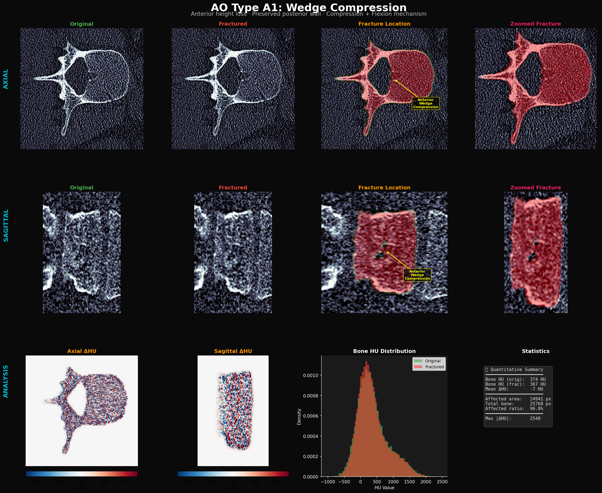
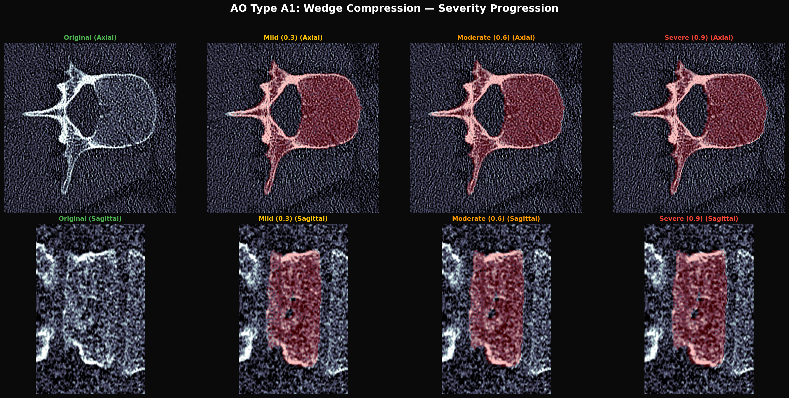

# AO Type A1: Wedge Compression Fracture

## Clinical Definition

AO Type A1 fractures are **compression injuries of a single endplate** caused by axial loading combined with flexion. The hallmark is **anterior column height loss** while the **posterior wall remains intact**. This is the most common thoracolumbar fracture, accounting for ~50% of all spine fractures (Magerl et al., 1994).

### Key Clinical Features
| Feature | Description |
|---------|-------------|
| **Mechanism** | Axial load + flexion moment |
| **Anterior height loss** | 10-50% depending on severity |
| **Posterior wall** | Intact (differentiates from burst) |
| **Endplate involvement** | Single endplate (superior or inferior) |
| **Stability** | Generally stable; neurological deficit rare |
| **Denis Classification** | Anterior column only |

---

## Visualization Results

### Detailed Analysis (Axial + Sagittal + Annotations + Zoomed)



**Figure interpretation:**
- **Row 1 (AXIAL):** Original → Fractured → Fracture Location (red overlay + yellow arrow showing "Anterior Wedge Compression") → Zoomed fracture region
- **Row 2 (SAGITTAL):** Same 4-panel layout showing the sagittal view, where anterior height loss is most clearly visible
- **Row 3 (ANALYSIS):** ΔHU maps (axial + sagittal), bone HU distribution comparison, and quantitative statistics

### Severity Progression (Axial + Sagittal)



**Progression notes:**
- **Mild (0.3):** Subtle anterior height reduction (~10%), minimal endplate irregularity
- **Moderate (0.6):** Clear wedge deformity (~25% height loss), visible fracture line
- **Severe (0.9):** Marked wedge deformity (~40% height loss), endplate disruption, posterior wall preserved

---

## Physics-Based Simulation Logic

### How We Simulate A1

Our simulation applies a **spatially-graded deformation field** that models the asymmetric collapse pattern of anterior column failure:

```
Compression(x, z) = severity × 10 × rel_z(anterior → posterior)
```

Where `rel_z` is 0 at the posterior wall and 1 at the anterior margin, creating a **gradient that compresses the anterior column more than the posterior**—exactly as in real flexion-compression injury.

### Step-by-step Simulation Pipeline

1. **Deformation Field Generation**
   - For each bone voxel, compute relative AP position (`rel_z`)
   - Apply linearly increasing compression toward the anterior
   - Smooth with Gaussian filter (σ=3) for biomechanically realistic distribution

2. **Inverse Warping**
   - Apply deformation via `scipy.ndimage.map_coordinates` for sub-voxel accuracy
   - Uses bilinear interpolation to maintain CT texture continuity

3. **Endplate Fracture Line**
   - `generate_hierarchical_fracture_surface()` creates a **multi-scale rough fracture line** at the superior endplate (~25% from anterior)
   - Fracture roughness scales with severity (0.7 × severity)
   - The fracture field applies a -35% to -65% HU reduction across the fracture zone, simulating **cortical disruption**

4. **CT Physics Effects**
   - Trabecular texture is preserved through the warping
   - HU values are clipped to [-1000, 3000] to maintain radiological validity

### Why This is Physically Correct

| Physical Principle | Our Implementation | Clinical Evidence |
|---|---|---|
| **Anterior column failure** | Gradient deformation: compression ∝ distance from posterior wall | Magerl (1994): A1 fractures show anterior height loss with intact posterior wall |
| **Flexion mechanism** | Asymmetric compression field maximized anteriorly | Denis (1983): Flexion injuries compress anterior column preferentially |
| **Endplate fracture** | Hierarchical fracture surface with multi-scale roughness | Oner (2005): Superior endplate fracture lines show irregular morphology |
| **HU reduction at fracture** | -65% to -35% HU in fracture zone | Real CT scans show cortical disruption as hypodense fracture lines |
| **Posterior wall preserved** | Zero deformation at `rel_z = 0` (posterior) | Defining feature of A1 vs A3/A4 classification |
| **Smooth deformation** | Gaussian-filtered displacement field | Bone deformation follows continuum mechanics, not discrete jumps |

### Source Code Reference
- Simulation: [`generate_visualizations.py → simulate_a1_wedge()`](generate_visualizations.py)
- Fracture surface: [`ct_physics.py → generate_hierarchical_fracture_surface()`](../../pipeline/modules/ct_physics.py)

---

## Quantitative Validation

From the generated analysis panel:
- **Mean ΔHU**: -7 HU (subtle overall density change, consistent with compression without comminution)
- **Max |ΔHU|**: 2548 (at fracture line location — endplate cortical disruption)
- **Affected ratio**: ~96.8% of bone voxels show some displacement (expected for global deformation)
- **HU distribution**: Fractured distribution shifts slightly left, consistent with trabecular compaction

---

## References

1. **Magerl F, Aebi M, Gertzbein SD, Harms J, Nazarian S.** (1994) "A comprehensive classification of thoracic and lumbar injuries." *Eur Spine J*, 3:184-201.
2. **Denis F.** (1983) "The Three Column Spine and Its Significance in the Classification of Acute Thoracolumbar Spinal Injuries." *Spine*, 8(8):817-831.
3. **Oner FC, et al.** (2005) "Changes in the disc space after fractures of the thoracolumbar spine." *JBJS*, 87(9):2022-2028.
4. **Vaccaro AR, et al.** (2013) "AOSpine thoracolumbar spine injury classification system." *Spine*, 38(22):2028-2037.
