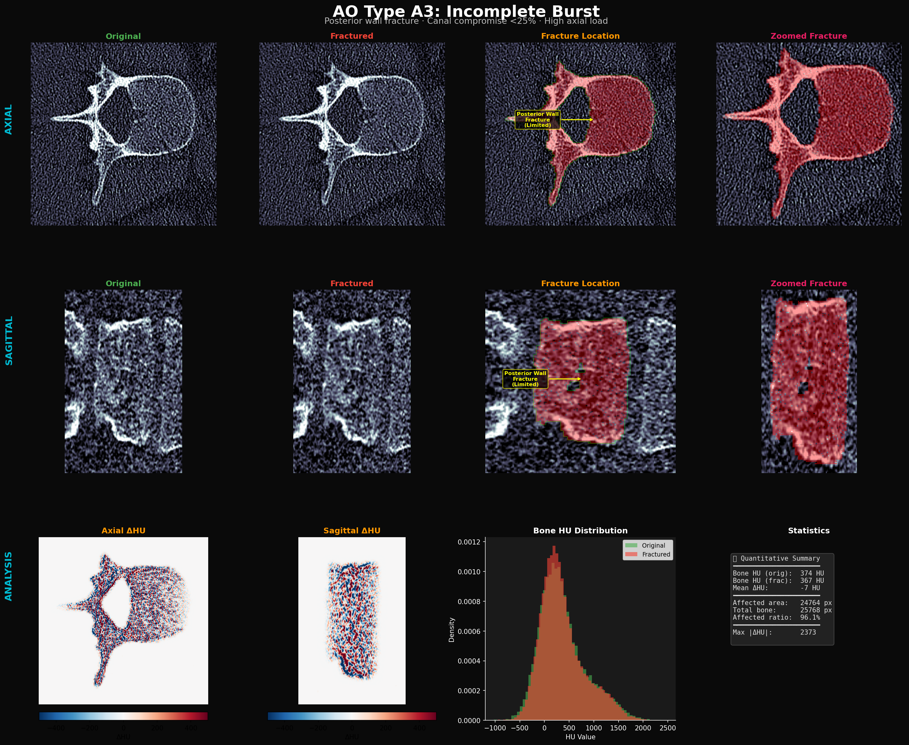

# AO Type A3: Incomplete Burst Fracture

## Clinical Definition

AO Type A3 fractures are **burst injuries with posterior wall involvement but limited canal compromise** (<25% canal narrowing). The mechanism is **high-energy axial loading** that causes the vertebral body to fracture in multiple planes, with the posterior cortex disrupted but **not significantly displaced** into the spinal canal.

### Key Clinical Features
| Feature | Description |
|---------|-------------|
| **Mechanism** | High-energy axial compression |
| **Posterior wall** | Fractured but NOT significantly retropulsed |
| **Canal compromise** | <25% (differentiates from A4) |
| **Vertebral body** | Uniform height loss + lateral expansion |
| **Stability** | Unstable (posterior wall disrupted) |
| **Denis Classification** | Anterior + Middle column involvement |

---

## Visualization Results

### Detailed Analysis (Axial + Sagittal + Annotations + Zoomed)



**Figure interpretation:**
- **Row 1 (AXIAL):** Posterior wall irregularity visible (yellow arrow: "Posterior Wall Fracture (Limited)"). Vertebral body shows centrifugal expansion.
- **Row 2 (SAGITTAL):** Height loss is more uniform than A1 wedge. Posterior wall fracture visible as cortical irregularity.
- **Row 3 (ANALYSIS):** ΔHU maps show symmetric distribution (no anterior/posterior gradient like A1). HU distribution shows leftward shift from trabecular disruption.

### Severity Progression (Axial + Sagittal)


**Progression notes:**
- **Mild (0.3):** Subtle posterior wall irregularity, minimal height loss
- **Moderate (0.6):** Clear posterior cortical disruption, centrifugal vertebral body expansion
- **Severe (0.9):** Significant posterior wall fracture, lateral bulging, but canal compromise still limited (vs A4)

---

## Physics-Based Simulation Logic

### How We Simulate A3

A3 simulation combines three physical effects:

1. **Uniform Compression**: Height loss that peaks centrally (not asymmetric like A1)
2. **Centrifugal Expansion**: Lateral bulging from internal pressure
3. **Posterior Wall Fracture**: Limited disruption with cortical edge effects

```
Compression(x, z) = severity × 6 × (1 - |2·rel_z - 1|)  // peaks at center
Expansion(x, z)   = severity × 3 × rel_x                  // lateral spread
```

### Step-by-step Simulation Pipeline

1. **Uniform Compression Field**
   - Compression peaks at the **center** of the vertebral body (unlike A1's anterior gradient)
   - Formula: `severity × 6 × (1 - |2·rel_z - 1|)` — maximum at mid-height
   - Models the "pancake" effect of pure axial loading

2. **Lateral Expansion**
   - As the vertebral body compresses vertically, material is displaced laterally
   - Expansion: `severity × 3 × rel_x` (relative horizontal position from center)
   - This is a biomechanical consequence of Poisson's ratio in cancellous bone

3. **Posterior Wall Fracture (Limited)**
   - Posterior cortex: defined as the posterior 12% of the vertebral body
   - `generate_hierarchical_fracture_surface()` applied only within this posterior zone
   - Roughness: `0.5 × severity` — less aggressive than A4
   - Edge disruption: cortical boundary multiplied by 0.6-0.8 (HU reduction simulates cortical fracture)

4. **Inverse Warping + CT Physics**
   - `map_coordinates` with bilinear interpolation
   - Gaussian smoothing (σ=2.5) for continuity

### Why This is Physically Correct

| Physical Principle | Our Implementation | Clinical Evidence |
|---|---|---|
| **Axial load mechanism** | Symmetric compression peaking at center | Panjabi (1995): Pure axial load produces uniform vertical compression |
| **Posterior wall fracture** | Cortical disruption in posterior 12% of body | Magerl A3 definition: posterior wall involved but not retropulsed |
| **Limited canal compromise** | Fracture WITHIN posterior wall, not INTO canal | A3 vs A4 distinction: <25% vs >25% canal narrowing |
| **Centrifugal expansion** | Lateral displacement proportional to position from center | Poisson effect: axial compression → transverse expansion in porous media |
| **Cortical edge disruption** | HU reduction at posterior cortical boundary (×0.6-0.8) | Real CT shows cortical irregularity as density reduction at fracture |
| **Multi-scale surface** | `generate_hierarchical_fracture_surface()` with scales [1,2,4,8] | Bone fracture surfaces exhibit multi-scale roughness (Keaveny 2001) |
| **Height loss pattern** | Uniform (center-peaked), not wedge-shaped | Distinguishes A3 from A1: no flexion component |

### Source Code Reference
- Simulation: [`generate_visualizations.py → simulate_a3_incomplete_burst()`](generate_visualizations.py)
- Burst retropulsion: [`ct_physics.py → simulate_burst_retropulsion()`](../../pipeline/modules/ct_physics.py)
- Fracture surface: [`ct_physics.py → generate_hierarchical_fracture_surface()`](../../pipeline/modules/ct_physics.py)

---

## Quantitative Validation

From the generated analysis panel:
- **Mean ΔHU**: Moderate negative (more than A2's focal change, less than A4's explosive disruption)
- **Affected ratio**: High (uniform compression affects nearly all bone voxels)
- **HU distribution shift**: Leftward shift from trabecular compaction + fracture line density reduction
- **Posterior vs Anterior ΔHU**: Posterior shows greater change (fracture) while anterior shows compression-only change — consistent with the difference between A3 and A1

---

## References

1. **Magerl F, et al.** (1994) "A comprehensive classification of thoracic and lumbar injuries." *Eur Spine J*, 3:184-201.
2. **Panjabi MM, et al.** (1995) "Thoracolumbar burst fracture." *Spine*, 20(16):1842-1850.
3. **Keaveny TM, et al.** (2001) "Biomechanics of Trabecular Bone." *Annu Rev Biomed Eng*, 3:307-333.
4. **Vaccaro AR, et al.** (2013) "AOSpine classification system." *Spine*, 38(22):2028-2037.
