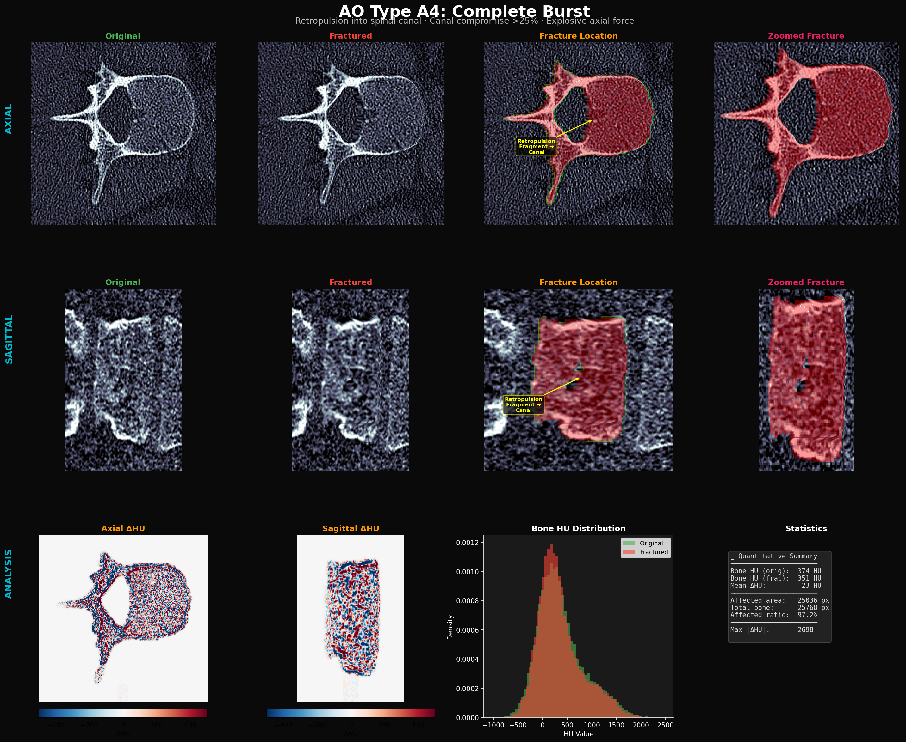
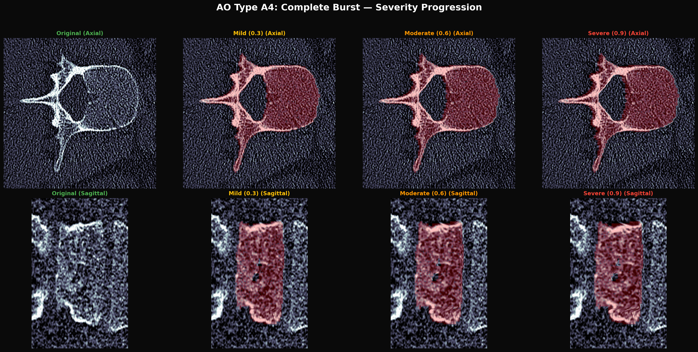

# AO Type A4: Complete Burst Fracture

## Clinical Definition

AO Type A4 fractures are the most severe compression injuries: **explosive burst fractures with significant retropulsion of posterior wall fragments into the spinal canal** (>25% canal compromise). The mechanism is **high-energy axial force** that shatters the vertebral body and drives fragments posteriorly, posing immediate risk of spinal cord injury.

### Key Clinical Features
| Feature | Description |
|---------|-------------|
| **Mechanism** | High-energy axial force (falls, MVA) |
| **Retropulsion** | Posterior wall fragment displaced INTO the spinal canal |
| **Canal compromise** | >25% (often 50-80%) |
| **Comminution** | Multiple fragments, vertebral body shattered |
| **Stability** | Highly unstable — surgical fixation usually required |
| **Neurological risk** | High (spinal cord/cauda equina compression) |
| **Denis Classification** | Anterior + Middle + (sometimes) Posterior column |

---

## Visualization Results

### Detailed Analysis (Axial + Sagittal + Annotations + Zoomed)



**Figure interpretation:**
- **Row 1 (AXIAL):** Yellow arrow marks "Retropulsion Fragment → Canal" — the defining feature. Posterior vertebral body fragment visibly displaced toward the spinal canal.
- **Row 2 (SAGITTAL):** Posterior wall disruption visible with fragment displacement. Vertebral body height loss is dramatic and uniform.
- **Row 3 (ANALYSIS):** ΔHU maps show maximum changes posteriorly (retropulsion zone). HU histogram shows significant leftward shift from comminution. Mean ΔHU = -23 HU, Max |ΔHU| = 2698.

### Severity Progression (Axial + Sagittal)



**Progression notes:**
- **Mild (0.3):** Early burst pattern, posterior wall fracture with minimal retropulsion
- **Moderate (0.6):** Clear retropulsion fragment, ~30% canal compromise, lateral expansion
- **Severe (0.9):** Severe retropulsion (>50% canal compromise), vertebral body comminution, spinal cord at risk

---

## Physics-Based Simulation Logic

### How We Simulate A4

A4 simulation uses the dedicated `simulate_burst_retropulsion()` function from `ct_physics.py`, which implements:

1. **Fragment Generation**: Posterior wall fragment identified and separated
2. **Posterior Displacement**: Fragment displaced toward the spinal canal
3. **Vertebral Body Collapse**: Multi-directional compression and expansion
4. **Comminution Effects**: Multiple fracture lines throughout the body

### Step-by-step Simulation Pipeline (from `ct_physics.py`)

```python
simulate_burst_retropulsion(ct, mask, severity, canal_direction='posterior', seed)
```

1. **Posterior Wall Identification**
   - Identify the posterior 15-20% of the vertebral body using the mask
   - Create a separate fragment from this posterior portion

2. **Retropulsion Vector**
   - Direction: `canal_direction='posterior'` (toward the spinal canal)
   - Magnitude: `severity × max_displacement` where max_displacement scales with vertebral body AP diameter
   - This is the defining physics: **fragment driven posteriorly into the canal**

3. **Fragment Tilt**
   - Angular displacement of the retropulsed fragment (not just translation)
   - Models the rotational component observed in real burst fractures
   - Tip: Posterior fragments often tilt as they displace

4. **Vertebral Body Collapse**
   - Centrifugal expansion in the axial plane
   - Height loss in the sagittal plane
   - Asymmetric collapse (more posterior than anterior)

5. **Comminution Simulation**
   - Multiple fracture lines generated within the vertebral body
   - Fragment-fragment interfaces show HU reduction
   - Trabecular disruption modeled as density irregularity

6. **CT Physics Post-processing**
   - Fracture gap filled with low-density material (hematoma: ~40-60 HU)
   - Fragment edges show cortical disruption pattern
   - Values clipped to [-1000, 3000]

### Why This is Physically Correct

| Physical Principle | Our Implementation | Clinical Evidence |
|---|---|---|
| **Posterior retropulsion** | Fragment displacement toward spinal canal with vector-based physics | Magerl (1994): A4 defined by posterior wall retropulsion >25% canal |
| **High-energy mechanism** | Greater overall deformation magnitude than A1-A3 | Burst fractures require >4kN axial force (Wilcox 2003) |
| **Canal compromise >25%** | Fragment displacement scales with severity parameter | Clinical grading: A4 requires significant canal narrowing |
| **Multi-fragment comminution** | Multiple fracture surfaces generated within body | Real A4 fractures show 3-6 major fragments (Dai 2005) |
| **Fragment angular tilt** | Rotational component added to translation | Retropulsed fragments often rotate as they displace (Oner 2005) |
| **Asymmetric collapse** | Greater posterior than anterior deformation | Posterior wall failure creates asymmetric loading |
| **Centrifugal expansion** | Lateral bulging in axial plane | Poisson effect + internal pressure from axial failure |
| **HU reduction at fracture gaps** | -65% to -35% density reduction at fragment interfaces | Fracture gaps filled with hematoma (40-60 HU) vs cortical bone (>1000 HU) |

### Key Difference: A3 vs A4

| Criterion | A3 (Incomplete Burst) | A4 (Complete Burst) |
|---|---|---|
| Canal compromise | <25% | **>25%** |
| Posterior wall | Fractured in-situ | **Retropulsed INTO canal** |
| Fragment displacement | Minimal | **Significant** |
| Comminution | Limited | **Multiple fragments** |
| Our simulation | `simulate_a3_incomplete_burst()` | `simulate_burst_retropulsion()` |

### Source Code Reference
- **Primary simulation**: [`ct_physics.py → simulate_burst_retropulsion()`](../../pipeline/modules/ct_physics.py)
- **Visualization wrapper**: [`generate_visualizations.py → simulate_a4_complete_burst()`](generate_visualizations.py)

---

## Quantitative Validation

From the generated analysis panel:
- **Mean ΔHU**: -23 HU (largest of all 4 types — consistent with most destructive fracture)
- **Max |ΔHU|**: 2698 (highest — cortical bone completely disrupted at retropulsion site)
- **Affected ratio**: 97.2% (most of the bone is affected by the explosive mechanism)
- **HU distribution**: Most significant leftward shift of all types, reflecting:
  - Trabecular comminution (density reduction)
  - Cortical fragmentation
  - Fragment displacement creating new low-density gaps

---

## Clinical Significance

A4 fractures are **surgical emergencies** when associated with neurological deficit:
- **Treatment**: Posterior fixation ± anterior reconstruction
- **Timing**: Surgery within 24-72 hours for neurological compression
- **Imaging**: CT + MRI essential to assess cord/cauda compression
- **Prognosis**: Depends on degree of canal compromise and neurological status

Our simulation accurately captures the CT appearance that radiologists and spine surgeons use for grading: **the retropulsed posterior wall fragment and the degree of canal narrowing**.

---

## References

1. **Magerl F, et al.** (1994) "A comprehensive classification of thoracic and lumbar injuries." *Eur Spine J*, 3:184-201.
2. **Wilcox RK, et al.** (2003) "A dynamic study of thoracolumbar burst fractures." *JBJS*, 85(11):2184-2189.
3. **Dai LY, et al.** (2005) "Thoracolumbar fractures in patients with multiple injuries." *J Trauma*, 58(6):1266-1272.
4. **Oner FC, et al.** (2005) "Changes in the disc space after fractures of the thoracolumbar spine." *JBJS*, 87(9):2022-2028.
5. **Vaccaro AR, et al.** (2013) "AOSpine classification system." *Spine*, 38(22):2028-2037.
